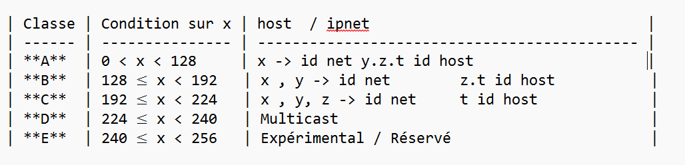

# Chapitre 02 — Adressage d’un réseau

## 1 Qu’est-ce qu’une adresse IP ?
    -> IP = Internet Protocol
    -> C’est l’adresse unique d’un appareil sur un réseau
    -> Elle permet à un appareil d’envoyer et de recevoir des données
    -> Elle fonctionne comme une adresse postale, mais pour les ordinateurs 

Sans adresse IP, un appareil ne peut pas communiquer sur le réseau.

## 2 Versions des adresses IP 

###  IPv4 
Format le plus utilisé historiquement
Exemple :
    -> 192.168.1.10

### IPv6
Créée pour résoudre le manque d’adresses IPv4
Exemple :
    -> 2001:0db8:85a3:0000:0000:8a2e:0370:7334

Dans ce chapitre, on se concentre sur IPv4.

## 3 Structure d’une adresse IPv4
    -> Une adresse IPv4 est composée de 4 octets
    -> Chaque octet = 8 bits
    -> Séparés par des points

    -> Forme générale :
        -> X.Y.Z.T
    -> Exemple :
        -> 192.168.1.1

Chaque adresse IPv4 appartient à une classe.

## 4 Classes des adresses IPv4
rappel : la forme du @ip est  : x.y.z.t
adresse Ip appartient a une classe (ABCDE)

## 5 Adresse IP publique 

    -> Visible sur Internet
    -> Fournie par le FAI (Fournisseur d’Accès Internet)
    -> Unique dans le monde

Exemple : 
    -> 102.45.67.89

## 6 Adresse IP privée 
    -> Utilisée dans un réseau local (LAN)
    -> Non visible sur Internet
    -> Plusieurs réseaux peuvent utiliser les mêmes IP privées sans conflit

## 7 Plages d’adresses privées (IPv4) 
Classe	Plage IP privée
A	    10.0.0.0 – 10.255.255.255
B	    172.16.0.0 – 172.31.255.255
C	    192.168.0.0 – 192.168.255.255

Toute adresse en dehors de ces plages est une adresse publique dans sa propre classe 

## 8Notion d’hôte (Host)
Un hôte est tout appareil connecté à un réseau :
    PC
    Serveur
    Smartphone
    Imprimante
#### Idée principale
    Chaque réseau a :
        -> Des bits pour le réseau
        -> Des bits pour les appareils (hôtes)
Plus il y a de bits pour les hôtes → plus il y a d’appareils possibles
Moins il y a de bits pour les hôtes → moins il y a d’appareils

#### Number of hosts=2power(bits for hosts)−2
    pour quoi -2 
    -> 1 pour adress réseau   (see )
    -> 2 pour brodcast adress (see 11)

## 9  CIDR (Classless Inter-Domain Routing)
L’idée du CIDR est donc de choisir exactement le nombre de bits pour les hôtes dont on a besoin, sans gaspiller d’adresses IP.
### Problème des classes ?
Avant, on devait obligatoirement utiliser les classes A, B ou C.
Cela posait un problème :
    -> Classe C : 254 hôtes maximum → parfois insuffisant
    ->Classe B : 65 534 hôtes → beaucoup trop grand
####  Résultat : gaspillage d’adresses IP.

## 10 Notation CIDR
exemple : 
    -> 192.168.1.0/24
    -> /24 → 24 bits pour le réseau
    -> Il reste : 32 − 24 = 8 bits pour les hôtes  (always 32 in ipv4)
### Calcul du nombre d’hôtes

    hosts = 2^(bits hôtes) − 2 
    hosts = 2^(8)-2 = 256 - 2 = 254
    Ce réseau peut avoir 62 appareils.
## 11 brodcast adress 
C’est une adresse spéciale dans chaque réseau
Permet d’envoyer un message à tous les appareils du réseau en même temps
On ne peut pas l’attribuer à un ordinateur ou appareil individuel
### Identifier la broadcast
Règle simple : la broadcast = la dernière adresse du réseau
    Ici : 192.168.1.0 → réseau
    Dernière adresse = 192.168.1.63 → broadcast
    Adresses utilisables pour les hôtes : 192.168.1.1 → 192.168.1.62
    (imagine it as intervals)
### exemple
    Adresse : 192.168.1.0/26
    Bits hôtes = 32 - 26 = 6
    Nombre d’adresses = 2^6 = 64
    Adresse réseau = 192.168.1.0
    Adresse broadcast = 192.168.1.0 + 63 = 192.168.1.63

## 12 default gateway
C'est l’adresse IP d’un routeur dans ton réseau local (LAN)
Sert de passerelle vers d’autres réseaux, comme Internet
Sans elle, un appareil ne peut pas communiquer en dehors de son réseau local
### Default gateway : 
souvent la première adresse disponible pour un appareil dans le réseau.

    Exemple : 192.168.1.1

Tous les PC du réseau envoient leurs paquets vers 192.168.1.1 si la destination est hors réseau.

## 13 Qu’est-ce que le DNS ?
DNS = Domain Name System
Sert à traduire les noms de domaine en adresses IP
Chaque appareil sur Internet communique avec des IP, mais les humains préfèrent des noms faciles à retenir
Exemple : 

    www.google.com

s ton ordinateur doit connaître l’adresse IP du serveur Google pour se connecter. c'est le travail du DNS 
Utilisateur → DNS → IP → Serveur web

## 14 Quelques points supplémentaires nous allons decouvrir....

    Masque de sous-réseau (Subnet Mask)
    Plages d’adresses réservées
    DHCP (Dynamic Host Configuration Protocol)
    IP statique vs IP dynamique
    ARP (Address Resolution Protocol)

## cisco commands pour la configuration  (not yet)
- [cisco commands](Chapters/ciscoCommands.md)